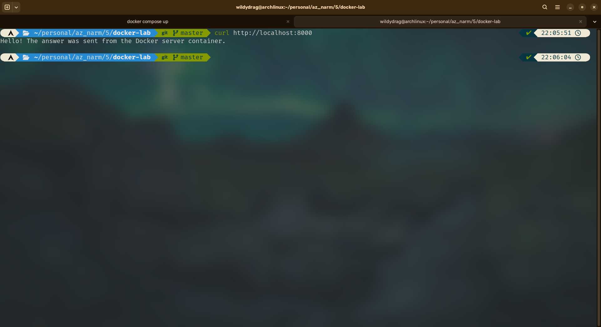
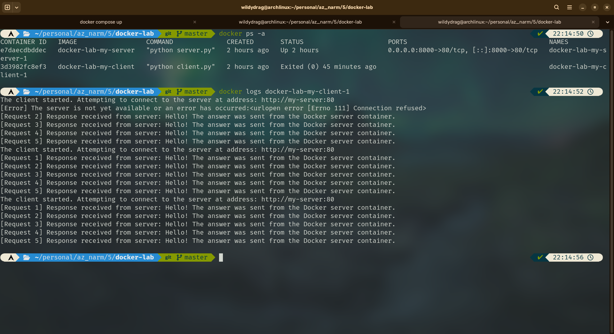
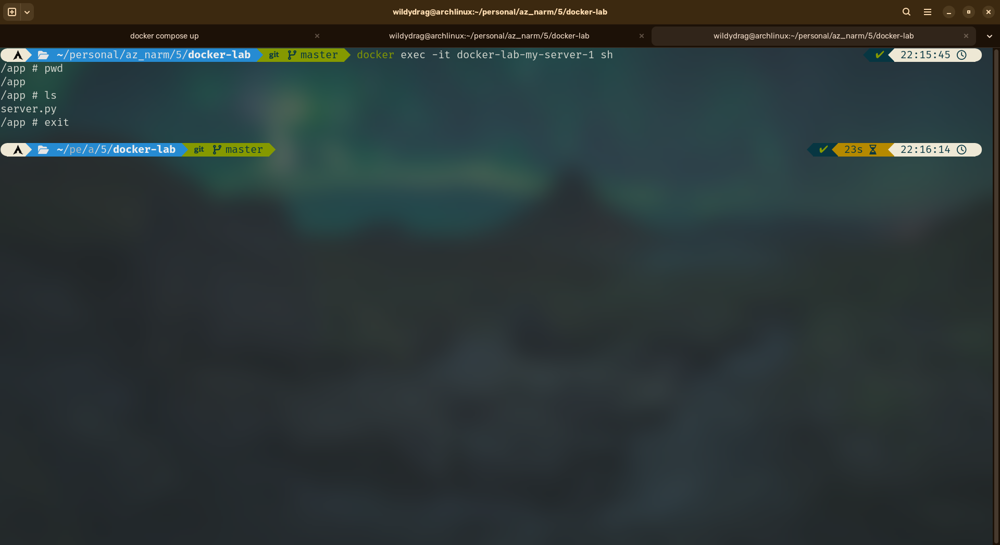

# آزمایش پنجم آزمایشگاه مهندسی نرم‌افزار

## Docker, Dockerfile و Docker Compose

این مخزن مربوط به آزمایش پنجم آزمایشگاه مهندسی نرم‌افزار است. هدف آزمایش، آشنایی عملی با ساخت Docker Image برای برنامه‌های Python، اجرای چند Container با Docker Compose، برقراری ارتباط شبکه‌ای بین Containerها و Port Forwarding بین Container و Host است.

---

## 1. ساختار پروژه

```text
docker-lab/
├── client/
│   ├── client.py
│   └── Dockerfile
├── server/
│   ├── server.py
│   └── Dockerfile
├── screenshots/
│   ├── 1-docker compose config.png
│   ├── 2-docker compose build.png
│   ├── 3-docker compose up.png
│   ├── 4-execute-curl-command.png
│   ├── 5-execute-docker-logs.png
│   └── 6-execute-docker-exec.png
├── docker-compose.yml
└── README.md
```

در این پروژه دو سرویس مستقل داریم:

- **my-server:** یک HTTP Server ساده با Python که روی پورت 80 داخل Container اجرا می‌شود.
- **my-client:** برنامه‌ای که پنج بار به Server درخواست HTTP ارسال می‌کند.

---

## 2. Dockerfile مربوط به Server

محتوای `server/Dockerfile`:

```dockerfile
FROM python:3.10-alpine

WORKDIR /app

COPY server.py .

CMD ["python", "server.py"]
```

### توضیح خطوط

- `FROM python:3.10-alpine`: از Image رسمی Python 3.10 مبتنی بر Alpine Linux استفاده می‌کند. Alpine یک توزیع کوچک Linux است و باعث می‌شود Image نسبتاً کم‌حجم باشد.
- `WORKDIR /app`: مسیر کاری داخل Container را به `/app` تغییر می‌دهد.
- `COPY server.py .`: فایل برنامه Server را از Context ساخت Image به `/app` داخل Container کپی می‌کند.
- `CMD ["python", "server.py"]`: هنگام اجرای Container، برنامه Server را با Python اجرا می‌کند.

خود `server.py` یک `HTTPServer` ساده ایجاد می‌کند و آن را روی پورت 80 داخل Container قرار می‌دهد. در پاسخ HTTP نیز پیام زیر ارسال می‌شود:

```text
Hello! The answer was sent from the Docker server container.
```

---

## 3. Dockerfile مربوط به Client

محتوای `client/Dockerfile`:

```dockerfile
FROM python:3.10-alpine

WORKDIR /app

COPY client.py .

CMD ["python", "client.py"]
```

ساختار آن مشابه Dockerfile مربوط به Server است. تفاوت اصلی این است که `client.py` در Image قرار گرفته و هنگام اجرای Container به عنوان برنامه اصلی اجرا می‌شود.

برنامه Client مقدار `SERVER_HOST` را از Environment Variable می‌خواند و به آدرس زیر درخواست می‌فرستد:

```text
http://<SERVER_HOST>:80
```

بنابراین نیازی نیست آدرس IP ثابت Container را در کد قرار دهیم.

---

## 4. Docker Compose

محتوای `docker-compose.yml`:

```yaml
services:
  my-server:
    build:
      context: ./server
      dockerfile: Dockerfile
    ports:
      - "8000:80"

  my-client:
    build:
      context: ./client
      dockerfile: Dockerfile
    environment:
      SERVER_HOST: my-server
```

### توضیح بخش Server

```yaml
my-server:
  build:
    context: ./server
    dockerfile: Dockerfile
```

این بخش به Compose می‌گوید Image مربوط به سرویس Server را با Dockerfile موجود در پوشه `server` بسازد.

```yaml
ports:
  - "8000:80"
```

این Port Mapping به این معنی است که:

```text
Host:      8000
Container: 80
```

بنابراین درخواست به `http://localhost:8000` از Host به پورت 80 داخل Container مربوط به Server هدایت می‌شود.

### توضیح بخش Client

```yaml
environment:
  SERVER_HOST: my-server
```

Docker Compose برای سرویس‌ها یک شبکه ایجاد می‌کند و نام سرویس‌ها را به عنوان hostname در شبکه قابل استفاده می‌کند. بنابراین Client می‌تواند بدون دانستن IP، Server را با نام زیر پیدا کند:

```text
my-server
```

در نتیجه Client به صورت داخلی به این آدرس متصل می‌شود:

```text
http://my-server:80
```

این یکی از مهم‌ترین بخش‌های آزمایش است: **نام سرویس در Docker Compose مانند یک hostname داخل شبکه Compose عمل می‌کند.**

---

## 5. مراحل انجام آزمایش

### 5.1 بررسی فایل Compose

ابتدا configuration نهایی Compose با دستور زیر بررسی شد:

```bash
docker compose config
```

خروجی نشان داد که دو سرویس `my-server` و `my-client` به درستی تعریف شده‌اند و `SERVER_HOST` روی `my-server` تنظیم شده است.


---

### 5.2 ساخت Imageها

برای ساخت Imageهای هر دو سرویس از دستور زیر استفاده شد:

```bash
docker compose build
```

در نتیجه دو Image ساخته شدند:

```text
docker-lab-my-server:latest
docker-lab-my-client:latest
```


> در محیط اجرا، Docker Compose هشداری درباره نبودن Buildx نمایش داد، اما از Builder کلاسیک استفاده کرد و Build هر دو Image با موفقیت انجام شد. این هشدار مانع اجرای آزمایش نبود.

---

### 5.3 اجرای سرویس‌ها

سرویس‌ها با دستور زیر اجرا شدند:

```bash
docker compose up
```

Docker یک شبکه پیش‌فرض برای پروژه ایجاد کرد و دو Container را بالا آورد.


---

### 5.4 بررسی Port Forwarding با curl

برای بررسی دسترسی به Server از Host، دستور زیر اجرا شد:

```bash
curl http://localhost:8000
```

خروجی:

```text
Hello! The answer was sent from the Docker server container.
```

این نتیجه نشان می‌دهد که Port Mapping زیر به درستی کار می‌کند:

```text
localhost:8000  →  my-server:80
```



---

### 5.5 مشاهده Logهای Client

برای مشاهده خروجی برنامه Client از دستور زیر استفاده شد:

```bash
docker logs docker-lab-my-client-1
```

در Logها مشخص است که Client آدرس زیر را استفاده کرده است:

```text
http://my-server:80
```

و درخواست‌ها پاسخ صحیح دریافت کرده‌اند.



این بخش به صورت عملی نشان می‌دهد که ارتباط بین دو Container از طریق نام سرویس Compose برقرار شده است.

---

### 5.6 ورود به Server Container با docker exec

برای اجرای یک Shell در Container مربوط به Server از دستور زیر استفاده شد:

```bash
docker exec -it docker-lab-my-server-1 sh
```

سپس داخل Container دستورات زیر اجرا شدند:

```bash
pwd
ls
```

خروجی نشان داد:

```text
/app
server.py
```

این خروجی هم `WORKDIR /app` و هم `COPY server.py .` را به صورت عملی تأیید می‌کند.



---

## 6. مفاهیم اصلی Docker

### Image چیست؟

Image یک الگوی immutable و قابل استفاده مجدد برای ایجاد Container است. Image شامل فایل‌ها، کتابخانه‌ها و تنظیمات موردنیاز برای اجرای یک برنامه است. در این آزمایش، Dockerfileها برای ساخت Imageهای `docker-lab-my-server` و `docker-lab-my-client` استفاده شدند.

### Container چیست؟

Container یک نمونه در حال اجرای یک Image است. Container محیط اجرای نسبتاً ایزوله‌ای برای برنامه فراهم می‌کند. در این آزمایش، Imageهای Server و Client به ترتیب به Containerهای `my-server` و `my-client` تبدیل شدند.

### Volume چیست؟

Volume مکانیزمی برای نگهداری داده خارج از lifecycle خود Container است. داده‌های Volume با حذف و ایجاد مجدد Container از بین نمی‌روند و برای persistent data، دیتابیس‌ها و فایل‌هایی که باید بین اجرای Containerها باقی بمانند کاربرد دارند.

به طور خلاصه:

```text
Image   → الگوی ساخت
Container → نمونه در حال اجرا
Volume  → محل نگهداری پایدار داده
```

---

## 7. پاسخ به سؤالات آزمایش

### سؤال ۱: هدف `docker-compose.yml` چیست و چه زمانی به جای `docker run` از آن استفاده می‌کنیم؟

`docker-compose.yml` یک فایل declarative برای تعریف و اجرای چند سرویس Docker است. در آن می‌توان Image یا نحوه Build، شبکه‌ها، Port Mapping، Environment Variableها، Volumeها و وابستگی‌های سرویس‌ها را مشخص کرد.

برای یک Container ساده، `docker run` معمولاً کافی است؛ اما وقتی یک برنامه از چند سرویس تشکیل شده باشد، استفاده از Compose بسیار مناسب‌تر است. در این آزمایش، به جای اجرای جداگانه Server و Client با چند دستور `docker run`، هر دو سرویس در یک فایل تعریف شدند و با یک دستور زیر اجرا شدند:

```bash
docker compose up
```

Compose همچنین یک شبکه مشترک ایجاد می‌کند و امکان دسترسی سرویس‌ها به یکدیگر با نام سرویس را فراهم می‌کند.

---

### سؤال ۲: Kubernetes چیست و چه ارتباطی با Docker دارد؟

**Kubernetes** یک سیستم orchestration برای مدیریت، استقرار، مقیاس‌دهی و پایش Containerها در محیط‌های توزیع‌شده و معمولاً در مقیاس بزرگ است. Docker بیشتر بر ساخت و اجرای Container تمرکز دارد و Kubernetes می‌تواند workloadهای containerized را روی چندین ماشین مدیریت و هماهنگ کند.

---

### سؤال ۳: Image، Container و Volume را توضیح دهید.

- **Image:** الگوی فقط‌خواندنی و قابل استفاده مجدد برای ساخت محیط اجرای برنامه.
- **Container:** نمونه‌ای از یک Image که اجرا شده و یک محیط runtime ایزوله فراهم می‌کند.
- **Volume:** فضای ذخیره‌سازی پایدار که lifecycle آن مستقل از Container است و برای حفظ داده‌ها استفاده می‌شود.

---

## 8. استفاده از هوش مصنوعی در انجام آزمایش

در انجام این آزمایش از یک دستیار هوش مصنوعی به عنوان **ابزار کمکی آموزشی و عیب‌یابی** استفاده شد. نقش AI جایگزین اجرای آزمایش نبود؛ دستورات در محیط واقعی Linux و Docker اجرا شدند و خروجی آن‌ها برای بررسی و تفسیر به AI ارائه شد.

موارد اصلی استفاده از AI عبارت بودند از:

1. **طراحی اولیه ساختار پروژه:** تعیین ساختار جداگانه برای Server و Client و Dockerfile مستقل برای هرکدام.
2. **توضیح Dockerfile:** بررسی مفاهیم `FROM`، `WORKDIR`، `COPY` و `CMD`.
3. **طراحی Docker Compose:** تعیین دو سرویس، Port Mapping و Environment Variable مربوط به Server.
4. **درک Docker Networking:** توضیح اینکه چرا Client می‌تواند از `my-server` به عنوان hostname استفاده کند.
5. **عیب‌یابی محیط Docker:** بررسی مشکلات مربوط به daemon، دسترسی به `/var/run/docker.sock` و نصب Docker Compose.
6. **تفسیر خروجی آزمایش:** تحلیل Logها، Port Forwarding، `docker exec` و خطای اولیه `Connection refused`.
7. **تهیه مستندات:** ساختاردهی گزارش آزمایش و توضیح نتایج.

### نمونه پرامپت‌های استفاده‌شده

چند نمونه از پرامپت‌های مورد استفاده در فرایند انجام آزمایش:

> «این آزمایش Docker آزمایشگاه مهندسی نرم‌افزار است. قدم‌به‌قدم راهنمایی‌ام کن که Dockerfile مربوط به server و client و docker-compose.yml را بنویسم.»

> «این Dockerfile را خط‌به‌خط توضیح بده و بگو WORKDIR، COPY و CMD دقیقاً چه کاری انجام می‌دهند.»

> «چرا در Docker Compose باید SERVER_HOST را برابر نام سرویس my-server قرار بدهیم؟ Docker چطور این نام را به IP کانتینر تبدیل می‌کند؟»

> «من docker compose up را اجرا کردم و اولین درخواست client با Connection refused مواجه شد ولی درخواست‌های بعدی موفق شدند. آیا این مشکل است؟ علتش چیست؟»

> «این خروجی docker ps -a و docker logs را بررسی کن و بگو آیا ارتباط بین client و server طبق صورت آزمایش درست انجام شده است؟»

> «برای این آزمایش یک README.md کامل بنویس که هم مراحل انجام آزمایش، هم پاسخ سؤال‌های تئوری و هم نحوه استفاده از AI را توضیح دهد.»

استفاده از AI در این پروژه عمدتاً به صورت **پرسش، اجرای پیشنهاد در محیط واقعی، مشاهده خروجی، و بازگرداندن خروجی برای تحلیل بعدی** انجام شد. به این ترتیب، صحت نتیجه صرفاً بر اساس پاسخ AI فرض نشد و هر مرحله با Docker واقعی آزمایش شد.

---

## 9. جمع‌بندی

در این آزمایش یک معماری ساده دو سرویسی با Docker پیاده‌سازی شد:

```text
                 Docker Compose Network
              ┌─────────────────────────┐
              │                         │
              │  my-client              │
              │      │                  │
              │      │ HTTP :80         │
              │      ▼                  │
              │  my-server              │
              │      │                  │
              └──────┼──────────────────┘
                     │
                  Port 80
                     ▲
                     │
              Host Port 8000
                     │
                     ▼
             http://localhost:8000
```

نتایج آزمایش نشان دادند که:

- هر سرویس با Dockerfile مستقل ساخته شد.
- هر دو Image با Docker Compose با موفقیت Build شدند.
- Client و Server در یک شبکه Docker قرار گرفتند.
- Client توانست Server را با hostname برابر `my-server` پیدا کند.
- Port 8000 روی Host به Port 80 داخل Server Container متصل شد.
- درخواست `curl http://localhost:8000` پاسخ صحیح دریافت کرد.
- Logهای Client موفقیت ارتباط بین دو Container را نشان دادند.
- با `docker exec` امکان ورود به Container و مشاهده فایل `server.py` فراهم شد.

---

## 10. اجرای مجدد پروژه

برای اجرای پروژه از ابتدا:

```bash
docker compose build
docker compose up
```

برای اجرای سرویس‌ها در پس‌زمینه:

```bash
docker compose up -d
```

برای مشاهده وضعیت Containerها:

```bash
docker ps -a
```

برای مشاهده Logهای Client:

```bash
docker logs docker-lab-my-client-1
```

برای توقف و حذف Containerها و شبکه Compose:

```bash
docker compose down
```

---

## لینک مخزن

[GitHub Repository](https://github.com/wildydrag/selab-exp5)
